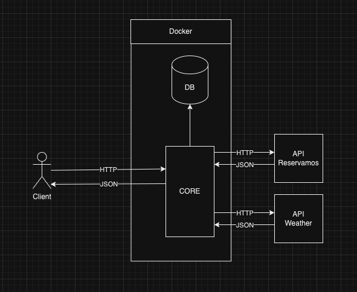

Reservamos Challenge
==============

  

This is a Docker (with docker-compose) environment and the instalation is required.

  

# Installation

  

1. First, clone this repository:

  

```bash

$  git  clone

```

  

2. Init project

```bash

$  make

```

  

3. Show containers:

```bash

$  make  ps

```

This results in the following running containers:

  

```bash

> $ docker-compose ps

Name  Command  State  Ports

----------------------------------------------------------------------------------------------------------

core  python  manage.py  runserver  ...  Up  0.0.0.0:8000->8000/tcp

postgres  docker-entrypoint.sh  postgres  Up  0.0.0.0:5432->5432/tcp

```

  

## The main services are host in:

| Service | Localhost | Staging |
| -- | -- | --|
| core |http://localhost:8000 | https://18.217.55.215:8000 |

  
  ### The public postman workspace

- https://www.postman.com/stjimmytzuc/workspace/reserchallenge

### Initial Data

- **1 User:** admin(superuser)

#### Information admin:

**`username:`**  `admin,`

**`password:`**  `admin`

  
  

### Considering Making Requests?:
#### URLs & endpoints:

- **API doc:**  *`/`*
- **Pronostico:** ***[GET]**`/api/pronostico/mer/{city_name}`*

  

Rules:

- *The Autorization is not required*

- *Login is not available*

- *You need a place name for petitions*

  

## diagrams and stuff

### Environment architecture


